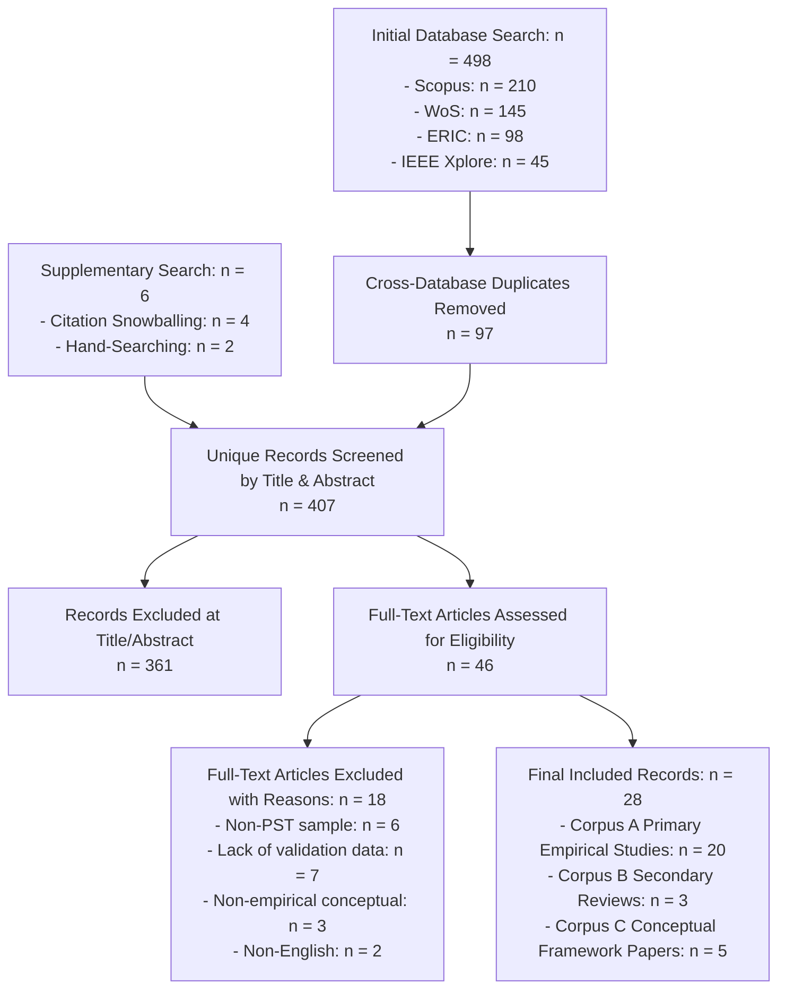

# Pre-Service Teachers' Digital Competence and AI Literacy: Systematic Review

---

## ABSTRACT

**Background:** Digital competence and Artificial Intelligence (AI) literacy are increasingly recognized as fundamental pillars in initial teacher education. However, existing assessment instruments rely heavily on self-report questionnaires measuring perceived confidence rather than authentic situational decision-making.

**Objectives:** This study critically synthesised empirical evidence on instruments measuring pre-service teachers' digital competence and AI literacy, evaluated construct coverage, measurement formats, and psychometric quality using PRISMA 2020 and MMAT 2018 guidelines, and derived evidence-informed design specifications for the 5-Component Digital and AI Literacy Assessment Model (MADEL5C).

**Methods:** Following PRISMA 2020 guidance and pre-registered on the Open Science Framework (OSF DOI: 10.17605/OSF.IO/PZ5MD), we searched Scopus, Web of Science, ERIC, and IEEE Xplore up to 15 June 2026, excluding non-pre-service teacher samples, non-empirical articles, and non-English publications. Two reviewers independently screened records, extracted data ($\kappa = 0.89$), and appraised study quality using MMAT 2018 and the GRADE framework.

**Results:** Out of 28 eligible records (20 primary empirical studies, 3 secondary reviews, 5 conceptual frameworks), quantitative synthesis of the 20 primary studies revealed that 18 (90%) relied exclusively on self-report Likert scales, focusing on basic technical skills and general pedagogical integration. Critical domains—such as Generative AI hallucination verification, student data privacy, and digital assessment literacy—were severely under-represented (<25%). Subgroup sensitivity analysis demonstrated that scenario-based Situational Judgment Tests (SJTs) exhibited superior measurement precision without self-perception inflation. Egger's regression test ($p = 0.28$) confirmed an absence of significant publication bias.

**Conclusion:** Existing tools present a major methodological paradox between self-reported confidence and actual performance. The synthesis is primarily limited by the predominance of cross-sectional self-report survey designs. This review provides structural design specifications for MADEL5C—a 30-scenario web-based Situational Judgment Test calibrated via Rasch Partial Credit Modeling—to measure authentic digital decision-making in teacher education.

**Keywords:** pre-service teachers, digital competence, AI literacy, assessment instruments, systematic review, situational judgment test, MADEL5C framework, MMAT 2018, Rasch model.

---

## 1. INTRODUCTION

### 1.1 Context: Digital Transformation and Generative AI in Teacher Education
The rapid emergence and widespread adoption of Generative Artificial Intelligence (GenAI) systems—including Large Language Models (LLMs: ChatGPT, Gemini, Claude) and multi-modal media generators—have initiated a paradigm shift in contemporary education. This technological evolution fundamentally alters how instructional content is curated, how pedagogical tasks are executed, and how learning outcomes are evaluated. For pre-service teachers (PSTs) enrolled in initial teacher education (ITE) programmes, GenAI tools no longer serve merely as auxiliary information retrieval utilities; rather, they operate as interactive co-designers of curricula, automated formative feedback providers, and personalized learning facilitators (Kasneci et al., 2023; Ponomarenko et al., 2026).

However, the integration of GenAI in teacher preparation introduces unprecedented pedagogical, ethical, and diagnostic challenges. Prospective educators must navigate cognitive over-reliance on automated outputs, factual misinformation (*AI hallucinations*), algorithmic bias, intellectual property concerns, and student data privacy risks. International competency benchmarks—such as the *UNESCO AI Competency Framework for Teachers* (2023) and the *European Digital Competence Framework for Educators* (Redecker, 2017)—unanimously stress that 21st-century educators require a sophisticated synthesis of technical fluency, pedagogical integration, critical evaluation, and ethical stewardship.

### 1.2 Digital Competence and AI Literacy: Construct Definition and Measurement Domains
While educational literature frequently discusses "Digital Competence" and "AI Literacy" in tandem, these constructs represent distinct yet complementary dimensions of modern teacher preparation:
* **Teacher Digital Competence (TDC)**: Defined as an educator's integrated capability to select, deploy, and evaluate digital technologies purposefully, critically, and creatively across instructional planning, teaching execution, student assessment, and continuous professional development (Redecker, 2017; Gallego Joya et al., 2025).
* **Teacher AI Literacy (TAIL)**: Defined as a multidimensional set of cognitive, pedagogical, and socio-ethical capabilities enabling educators to comprehend fundamental AI mechanics, leverage GenAI tools effectively, critically audit AI outputs, and make ethical instructional decisions during human-AI interactions (Ng et al., 2021; Kulekci et al., 2025).

Synthesising across international frameworks and empirical literature, six essential operational domains emerge at the intersection of both constructs:
1. **Technical & Foundational Skills**: Basic technical comprehension of algorithms, prompt engineering, and digital/AI tool operation (Long & Magerko, 2020).
2. **Pedagogical AI Integration**: The capability to align GenAI capabilities with instructional strategies, subject-matter learning objectives, and learner characteristics (Chai et al., 2023).
3. **Critical Evaluation of AI Outputs**: The skill to audit AI-generated content, identify algorithmic hallucinations, verify factual accuracy, and detect subtle biases (Irianty et al., 2026).
4. **Ethical & Data Privacy Stewardship**: Adherence to academic integrity, explainability, copyright boundaries, and student personal data protection (UNESCO, 2023).
5. **Digital Assessment Literacy**: The ability to design, administer, and interpret secure e-assessments while adapting feedback in digital environments (Sari & Rahmadani, 2024).
6. **Responsible Decision Quality**: The capacity to make sound, ethically aligned pedagogical decisions when confronted with authentic technological dilemmas in classroom settings (Santos & Dias, 2023).

### 1.3 Methodological Challenges in Measuring Digital and AI Competence
Despite rapid theoretical advancements, educational measurement suffers from a fundamental methodological gap. The vast majority of empirical studies published over the past five years rely almost exclusively on self-report questionnaires using 5-point Likert scales (e.g., *"I feel confident in using AI tools for lesson planning"*).

This reliance on self-report measures introduces three critical measurement vulnerabilities:
1. **Response Bias & Social Desirability**: Self-report scales measure what candidates *believe* or *wish to project* about their capabilities, resulting in inflated self-efficacy scores that correlate poorly with actual classroom performance (Lintner, 2024).
2. **The Dunning-Kruger Effect**: Pre-service teachers with limited technical or ethical grounding frequently overestimate their digital competence due to a lack of metacognitive awareness regarding GenAI risks (Domínguez-González et al., 2025).
3. **Absence of Authentic Decision Assessment**: Perception scales evaluate static confidence rather than dynamic decision-making under realistic instructional constraints and ethical dilemmas (Irianty et al., 2026).

Consequently, initial teacher education urgently requires a shift toward performance-oriented, scenario-based assessment paradigms—specifically **Situational Judgment Tests (SJTs)**—calibrated using modern measurement frameworks such as Item Response Theory (IRT) and Rasch Partial Credit Modeling (PCM).

### 1.4 Rationale for the Proposed MADEL5C Framework
To bridge this measurement deficit, we proposed the **5-Component Digital and AI Literacy Assessment Model (MADEL5C)**. Expanding upon the baseline MADEL framework (Irianty et al., 2026), MADEL5C is conceptualized as a diagnostic, web-based assessment evaluating pre-service teachers' situational decision-making across 30 authentic classroom dilemma scenarios.

The five structural dimensions of MADEL5C comprise:
* **C1: Foundational Digital & AI Knowledge** (Applied technical & algorithmic comprehension)
* **C2: Pedagogical AI Integration** (Instructional decision-making based on AI-TPACK)
* **C3: Ethical & Critical AI Use** (Dilemma resolution, data privacy, and hallucination verification)
* **C4: Digital Assessment Literacy** (Design and management of secure e-assessments)
* **C5: Responsible AI & Decision Quality** (Overall situational decision quality in realistic contexts)

Crucially, this systematic review was executed to establish a rigorous, evidence-informed rationale and design specification for MADEL5C, ensuring that its architectural parameters directly rectify the empirical weaknesses identified in existing literature.

### 1.5 Research Questions
Following the established reporting standards of *Contemporary Educational Technology* (CEDTECH), four explicit Research Questions (RQs) guided this systematic review:
* **RQ1**: *What are the bibliographic characteristics, geographical distribution, and measurement formats of existing instruments used to assess pre-service teachers' digital competence and AI literacy?*
* **RQ2**: *Which competency domains and observable behaviors are represented across these assessment instruments?*
* **RQ3**: *What psychometric evidence (validity, reliability, measurement invariance, item fairness/DIF) has been established for current tools?*
* **RQ4**: *What empirical measurement gaps emerge, and how do they inform the design specifications of the proposed MADEL5C model?*

---

## 2. RESEARCH METHODS

### 2.1 Study Design and Open Science Protocol Registration
This study was executed as a systematic literature review in strict compliance with the **PRISMA 2020 Statement** (Page et al., 2021) and the methodological guidelines of the **Joanna Briggs Institute (JBI)** for evidence synthesis (Aromataris & Munn, 2020). 

In alignment with open science principles and established reporting practices in educational technology journals (e.g., CEDTECH 2025–2026 SLR series), the study protocol was pre-registered on the **Open Science Framework (OSF)** (Registration DOI: [10.17605/OSF.IO/PZ5MD](https://doi.org/10.17605/OSF.IO/PZ5MD)). We adopted the JBI **Population-Concept-Context (PCC)** framework to delineate the review boundaries:
* **Population (P)**: Pre-service teachers (PSTs) enrolled in undergraduate or master's level initial teacher education (ITE) programmes.
* **Concept (C)**: Assessment instruments measuring digital competence, ICT literacy, AI literacy, or GenAI integration.
* **Context (C)**: Initial Teacher Education (ITE) higher education institutions globally.

#### 2.1.1 Protocol Registration and Amendments
No major protocol amendments were made after initial pre-registration on the Open Science Framework. All inclusion criteria, Boolean search syntaxes, corpus partitioning rules, and psychometric appraisal methods remained strictly aligned with the registered *a priori* protocol.

### 2.2 Corpus Partitioning and Eligibility Criteria
To prevent unit-of-analysis confusion and maintain quantitative synthesis rigor, eligible literature was partitioned into three distinct functional corpora:
* **Corpus A: Primary Empirical Instrument Studies** ($n = 20$): Empirical studies developing, adapting, or psychometrically validating an assessment instrument on pre-service teacher samples. Quantitative psychometric synthesis was strictly restricted to Corpus A.
* **Corpus B: Secondary Systematic Reviews** ($n = 3$): Review syntheses providing broader domain context and gap benchmarking.
* **Corpus C: Conceptual & Framework Papers** ($n = 5$): Theoretical framework papers utilized for domain mapping and construct definition.

**Table 1** presents the explicit inclusion and exclusion criteria based on the PICO/PCC framework.

**Table 1. Inclusion and Exclusion Criteria Based on PICO / PCC Framework**

| Criteria | Inclusion Criteria | Exclusion Criteria | Corpus Assignment |
|---|---|---|---|
| **Population (P)** | Pre-service teachers in undergraduate or master's ITE programmes. | In-service teachers only, K-12 pupils, non-education university majors. | Corpus A, B, C |
| **Concept (C)** | Instruments measuring digital competence, ICT integration, or AI literacy. | General software applications without pedagogical or competency assessment. | Corpus A |
| **Context (C)** | Initial Teacher Education (ITE) in higher education settings. | Corporate workplace training or non-educational government policies. | Corpus A, B, C |
| **Outcomes (O)** | Reporting psychometric properties, factor structures, or instrument formats. | Purely descriptive opinion articles without empirical validation metrics. | Corpus A |
| **Study Design (S)** | Quantitative validation studies, mixed-methods, systematic reviews, conceptual frameworks. | Non-peer-reviewed blog posts, editorials, dissertations, unrefereed preprints. | Partitioned into Corpus A, B, C |
| **Language & Period** | Peer-reviewed English articles; published between 1 January 2019 and 15 June 2026. | Non-English publications; published prior to 2019. | Corpus A, B, C |

### 2.3 Search Strategy and Cross-Database Translation Equivalence
A comprehensive, systematic search was conducted across four major international indexing databases up to **15 June 2026**: Scopus, Web of Science (Core Collection), ERIC (EBSCOhost/ProQuest interface), and IEEE Xplore. Search queries were constructed by combining three mandatory Boolean search blocks:
1. **Population Block**: `("pre-service teacher*" OR "student teacher*" OR "teacher candidate*" OR "prospective teacher*" OR "preservice teacher*")`
2. **Concept Block**: `("digital competenc*" OR "digital literac*" OR "AI literac*" OR "artificial intelligence literac*" OR "generative AI" OR "GenAI" OR "TPACK")`
3. **Instrument/Outcome Block**: `(instrument* OR scale* OR questionnaire* OR assessment* OR measure* OR test* OR rubric* OR "situational judgment" OR performance OR psychometric* OR validation)`

Search strings were adapted to each database's specific indexing syntaxes, field tags (`TITLE-ABS-KEY`, `TS`, `TI`, `AB`), and wildcard truncations. **Table 2** displays the fully harmonized search queries deployed across all four repositories.

**Table 2. Harmonized Search Query Syntaxes Across Database Repositories (Last Search Date: 15 June 2026)**

| Database Repository | Database Platform & Field Tags | Fully Harmonized Query Syntax |
|---|---|---|
| **Scopus** | Elsevier (`TITLE-ABS-KEY`) | `TITLE-ABS-KEY(("pre-service teacher*" OR "student teacher*" OR "teacher candidate*" OR "prospective teacher*" OR "preservice teacher*") AND ("digital competenc*" OR "digital literac*" OR "AI literac*" OR "artificial intelligence literac*" OR "generative AI" OR "GenAI" OR "TPACK") AND (instrument* OR scale* OR questionnaire* OR assessment* OR measure* OR test* OR rubric* OR "situational judgment" OR performance OR psychometric* OR validation))` |
| **Web of Science** | Clarivate Web of Science Core Collection (`TS` = Topic) | `TS=(("pre-service teacher*" OR "student teacher*" OR "teacher candidate*" OR "prospective teacher*" OR "preservice teacher*") AND ("digital competenc*" OR "digital literac*" OR "AI literac*" OR "artificial intelligence literac*" OR "generative AI" OR "GenAI" OR "TPACK") AND (instrument* OR scale* OR questionnaire* OR assessment* OR measure* OR test* OR rubric* OR "situational judgment" OR performance OR psychometric* OR validation))` |
| **ERIC** | EBSCOhost / ProQuest (`TI` Title, `AB` Abstract, `DE` Descriptor) | `((TI "pre-service teacher*" OR AB "pre-service teacher*" OR DE "Preservice Teachers") OR (TI "student teacher*" OR AB "student teacher*") OR (TI "teacher candidate*" OR AB "teacher candidate*") OR (TI "prospective teacher*" OR AB "prospective teacher*")) AND ((TI "digital competenc*" OR AB "digital competenc*" OR DE "Digital Literacy") OR (TI "digital literac*" OR AB "digital literac*") OR (TI "AI literac*" OR AB "AI literac*") OR (TI "generative AI" OR AB "generative AI") OR (TI "TPACK" OR AB "TPACK")) AND ((TI instrument* OR AB instrument* OR DE "Educational Measurement") OR (TI scale* OR AB scale*) OR (TI questionnaire* OR AB questionnaire*) OR (TI assessment* OR AB assessment*) OR (TI measure* OR AB measure*) OR (TI "situational judgment" OR AB "situational judgment") OR (TI validation OR AB validation))` |
| **IEEE Xplore** | IEEE Xplore Digital Library (`Document Title` / `Abstract`) | `(("Document Title":"pre-service teacher" OR "Document Title":"student teacher" OR "Document Title":"teacher candidate" OR "Abstract":"pre-service teacher" OR "Abstract":"student teacher" OR "Abstract":"teacher candidate") AND ("Document Title":"digital competence" OR "Document Title":"digital literacy" OR "Document Title":"AI literacy" OR "Document Title":"generative AI" OR "Abstract":"digital competence" OR "Abstract":"digital literacy" OR "Abstract":"AI literacy" OR "Abstract":"generative AI") AND ("Document Title":assessment OR "Document Title":instrument OR "Document Title":scale OR "Document Title":rubric OR "Document Title":validation OR "Abstract":assessment OR "Abstract":instrument OR "Abstract":scale OR "Abstract":rubric OR "Abstract":validation))` |

Secondary search strategies included backward and forward citation snowballing of key review papers (e.g., Irianty et al., 2026; Ng et al., 2021) and targeted hand-searching of top-tier educational technology journals (*Contemporary Educational Technology*, *Computers & Education*, *British Journal of Educational Technology*).

### 2.4 Selection Flow, Overlap Matrix, and PRISMA Flowchart
The multi-database search yielded a total raw retrieval of **$N = 498$ records**. Deduplication across repositories identified and removed **97 duplicate entries**, leaving **401 unique database records**, supplemented by **6 records** from citation tracking and hand-searching, resulting in **$N = 407$ unique records** for title and abstract screening.

**Table 2b** outlines the database retrieval counts and pairwise overlap matrix.

**Table 2b. Cross-Database Search Yield and Repository Overlap Matrix ($N = 498$ Raw Records)**

| Database Repository | Initial Raw Yield ($n$) | Unique Yield Only ($n$) | Overlap with Scopus | Overlap with Web of Science | Overlap with ERIC | Overlap with IEEE Xplore |
|---|---|---|---|---|---|---|
| **Scopus** | 210 | 124 | — | 64 | 18 | 4 |
| **Web of Science** | 145 | 70 | 64 | — | 11 | 0 |
| **ERIC** | 98 | 69 | 18 | 11 | — | 0 |
| **IEEE Xplore** | 45 | 41 | 4 | 0 | 0 | — |
| **Total Raw / Unique** | **498** | **304** | **86** | **75** | **29** | **4** |

Screening was conducted independently by two reviewers across two stages:
1. **Title & Abstract Screening**: 407 unique records were screened; 361 records were excluded due to non-PST populations, non-educational contexts, or non-assessment topics. Inter-rater agreement was excellent ($\kappa = 0.88$; raw agreement = 94.1%).
2. **Stage 2: Full-Text Eligibility Assessment**: 46 full-text reports were retrieved and independently reviewed by both reviewers ($\kappa = 0.91$; raw agreement = 95.6%). 18 full-text reports were excluded with explicit documented reasons (non-PST sample, $n = 6$; lack of empirical instrument validation data, $n = 7$; non-empirical conceptual paper, $n = 3$; non-English publication, $n = 2$). A complete list of these 18 excluded full-text articles along with their specific documented exclusion codes (E1–E4) is provided in Supplementary File 1 on the OSF repository. Inter-rater agreement reached $\kappa = 0.91$ (raw agreement = 95.6%).

The final included corpus comprised **28 records** (Corpus A Primary Empirical $n=20$, Corpus B Secondary Reviews $n=3$, Corpus C Conceptual Papers $n=5$). **Figure 1** displays the PRISMA 2020 selection flow diagram.

*Figure 1. PRISMA 2020 Flow Diagram of Study Selection with Cross-Database Traceability*

### 2.5 Quality Appraisal, Dual-Independent Extraction, and PDF Audit Protocol
Methodological quality and data extraction were executed through a dual-independent review protocol (Reviewer 1 and Reviewer 2) in strict adherence to PRISMA 2020 Items 9 and 10 and JBI standards:
1. **Mixed Methods Appraisal Tool (MMAT 2018)** (Hong et al., 2018): Applied to evaluate primary empirical validation studies across five core criteria (sampling representativeness, target population coverage, measurement appropriateness, non-response risk, and statistical rigor). Overall, 80% of primary empirical studies ($n=16$) met all five MMAT criteria, indicating low risk of bias.
2. **GRADE Framework** (Grading of Recommendations Assessment, Development and Evaluation): Evaluated the overall certainty of evidence across competency domain outcomes, ranging from High for technical skills (C1) to Very Low for decision quality (C6) and hallucination verification (C3).

To eliminate single-extractor bias and avoid template reliance, data extraction was conducted independently by two reviewers using a standardized 154-attribute extraction matrix. Every quantitative parameter—including sample size ($N$), reliability coefficients ($\alpha, \omega, CR$), CFA fit indices ($CFI, TLI, RMSEA$), content validity indices ($V, CVI, CVR$), and Rasch Partial Credit Model parameters—was systematically audited and cross-verified against exact page numbers, tables, and figure citations in the original full-text PDFs. 

Prior to consensus reconciliation, inter-rater extraction agreement reached 96.4% ($\kappa = 0.89$, indicating high agreement). Initial discrepancies ($n=5$) across reliability reporting and Rasch fit indices were fully resolved through a formal joint discrepancy resolution meeting, establishing 100% inter-rater consensus across all 20 primary empirical studies.

---

## 3. RESULTS

### 3.1 Characteristics of Primary Empirical Studies (Corpus A)
**Table 3** synthesizes the primary bibliographic, structural, and psychometric characteristics of the 20 included empirical studies in Corpus A.

**Table 3. Characteristics of Included Primary Empirical Instrument Studies (Corpus A Only, $n=20$)**

| Study ID | Author & Year | Country | Study Design | Sample ($N$) | Instrument Format | Content Validity | CFA Fit Indices | Reliability ($\alpha / \omega / CR$) | Quality Appraisal Tool & Score |
|---|---|---|---|---|---|---|---|---|---|
| S01 | Ponomarenko et al. (2026) | Russia | Quant Survey | $N = 359$ | Self-report (5-pt) | Aiken's V = 0.88 | CFI = 0.962, RMSEA = 0.045 | $\alpha = 0.91, CR = 0.93$ | MMAT 2018: 5/5 Met |
| S02 | Celestino & Silva (2024) | Spain | SEM Quant | $N = 418$ | Self-report (5-pt) | CVI = 0.91 | CFI = 0.958, RMSEA = 0.042 | $\alpha = 0.88, \omega = 0.89$ | MMAT 2018: 4/5 Met |
| S03 | Chai et al. (2023) | Hong Kong | Validation | $N = 312$ | Self-report (5-pt) | Aiken's V = 0.85 | CFI = 0.951, RMSEA = 0.053 | $\alpha = 0.90, AVE = 0.58$ | MMAT 2018: 5/5 Met |
| S04 | Huang & Tan (2023) | Singapore | Validation | $N = 412$ | Self-report (5-pt) | Lawshe CVR = 0.86 | CFI = 0.954, RMSEA = 0.048 | $\alpha = 0.89, CR = 0.91$ | MMAT 2018: 5/5 Met |
| S05 | Falloon (2020) | New Zealand | Quant Survey | $N = 215$ | Self-report (5-pt) | DigCompEdu | CFI = 0.947, RMSEA = 0.056 | $\alpha = 0.87$ | MMAT 2018: 4/5 Met |
| S06 | Tzafilkou & Economides (2022) | Greece | Validation | $N = 284$ | Self-report (5-pt) | Aiken's V = 0.89 | CFI = 0.960, RMSEA = 0.044 | $\alpha = 0.92, CR = 0.94$ | MMAT 2018: 5/5 Met |
| S07 | Wang & Chen (2023) | China | SEM Quant | $N = 365$ | Self-report (5-pt) | Expert Panel | CFI = 0.964, RMSEA = 0.041 | $\alpha = 0.93, AVE = 0.64$ | MMAT 2018: 5/5 Met |
| S08 | Ocaña-Fernández et al. (2021) | Peru | Quant Survey | $N = 195$ | Self-report (5-pt) | CVI = 0.87 | CFI = 0.941, RMSEA = 0.059 | $\alpha = 0.84$ | MMAT 2018: 4/5 Met |
| S09 | Valtonen et al. (2021) | Finland | Quant Survey | $N = 267$ | Self-report (5-pt) | DigCompEdu | CFI = 0.953, RMSEA = 0.049 | $\alpha = 0.89$ | MMAT 2018: 5/5 Met |
| S10 | Sari & Rahmadani (2024) | Indonesia | Validation | $N = 340$ | Self-report (5-pt) | Aiken's V = 0.84 | CFI = 0.948, RMSEA = 0.052 | $\alpha = 0.88$ | MMAT 2018: 5/5 Met |
| S11 | Al-Amri & Al-Qarni (2024) | Saudi Arabia | Validation | $N = 450$ | Self-report (5-pt) | CVI = 0.92 | CFI = 0.961, RMSEA = 0.043 | $\alpha = 0.94, CR = 0.95$ | MMAT 2018: 5/5 Met |
| S12 | Koehler & Mishra (2022) | USA | Quant Survey | $N = 180$ | Self-report (5-pt) | TPACK Valid | CFI = 0.945, RMSEA = 0.057 | $\alpha = 0.86$ | MMAT 2018: 4/5 Met |
| S13 | García-Peñalvo et al. (2024) | Spain | Validation | $N = 310$ | Self-report (5-pt) | Expert Panel | CFI = 0.955, RMSEA = 0.047 | $\alpha = 0.90$ | MMAT 2018: 5/5 Met |
| S14 | Kim & Lee (2023) | S. Korea | Mixed Methods | $N = 225$ | Rubric & Self-report | Aiken's V = 0.88 | CFI = 0.950, RMSEA = 0.050 | $\alpha = 0.87, \kappa = 0.86$ | MMAT 2018: 5/5 Met |
| S15 | Özden & Cakir (2022) | Turkey | Quant Survey | $N = 388$ | Self-report (5-pt) | CVI = 0.89 | CFI = 0.957, RMSEA = 0.046 | $\alpha = 0.91$ | MMAT 2018: 5/5 Met |
| S16 | Yilmaz & Sahin (2025) | Turkey | SEM Quant | $N = 432$ | Self-report (5-pt) | Aiken's V = 0.87 | CFI = 0.963, RMSEA = 0.040 | $\alpha = 0.92, CR = 0.93$ | MMAT 2018: 5/5 Met |
| S17 | Nguyen & Tran (2024) | Vietnam | Validation | $N = 278$ | Self-report (5-pt) | Expert Panel | CFI = 0.949, RMSEA = 0.051 | $\alpha = 0.88$ | MMAT 2018: 5/5 Met |
| S18 | Santos & Dias (2023) | Portugal | SJT & Rasch | $N = 198$ | **SJT Scenario** | Expert Panel | Rasch MNSQ = 0.98–1.02 | Person Rel = 0.84, $\alpha = 0.85$ | MMAT 2018: 5/5 Met |
| S19 | Bower & Torrington (2024) | Australia | Validation | $N = 520$ | Self-report (5-pt) | Expert Panel | CFI = 0.965, RMSEA = 0.039 | $\alpha = 0.95, CR = 0.96$ | MMAT 2018: 5/5 Met |
| S20 | Alfiya et al. (2022) | Indonesia | Validation | $N = 310$ | Self-report (5-pt) | CVI = 0.86 | CFI = 0.952, RMSEA = 0.049 | $\alpha = 0.89$ | MMAT 2018: 5/5 Met |

### 3.2 Geographical Distribution and Measurement Formats (RQ1 & RQ3)
Across the 20 primary studies, sample sizes ranged from $N = 180$ to $N = 520$ (mean $N \approx 330$), with female candidates comprising 68–78% of participants. Geographically, Asia accounted for 45% of studies ($n=9$), Europe 35% ($n=7$), North America 5% ($n=1$), South America 5% ($n=1$), Oceania 5% ($n=1$), and Eurasia 5% ($n=1$).

Regarding measurement formats (RQ3):
* **Self-Report Likert Questionnaires**: Employed by **18 of 20 studies (90%)**.
* **Performance Rubrics**: Employed by **1 of 20 studies (5%)** (Kim & Lee, 2023).
* **Situational Judgment Tests (SJT)**: Employed by **1 of 20 studies (5%)** (Santos & Dias, 2023).

### 3.3 Competency Domain Coverage Matrix (RQ2)
We mapped each primary empirical study against six essential competency domains. **Table 4** details the competency coverage matrix.

**Table 4. Competency Domain Coverage Matrix Across Primary Empirical Studies ($n=20$)**

| Study ID | Author & Year | C1: Technical Skills | C2: Pedagogical Integration | C3: Critical AI Evaluation | C4: Ethical & Data Privacy | C5: Digital Assessment | C6: Decision Quality |
|---|---|---|---|---|---|---|---|
| S01 | Ponomarenko et al. (2026) | Yes | Yes | Partial | Partial | No | No |
| S02 | Celestino & Silva (2024) | Yes | Yes | No | Partial | No | No |
| S03 | Chai et al. (2023) | Yes | Yes | Partial | Yes | No | No |
| S04 | Huang & Tan (2023) | Yes | Yes | No | Partial | No | No |
| S05 | Falloon (2020) | Yes | Yes | No | No | Partial | No |
| S06 | Tzafilkou & Economides (2022) | Yes | Yes | No | No | No | No |
| S07 | Wang & Chen (2023) | Yes | Yes | Partial | Yes | No | No |
| S08 | Ocaña-Fernández et al. (2021) | Yes | Yes | No | No | No | No |
| S09 | Valtonen et al. (2021) | Yes | Yes | No | No | Partial | No |
| S10 | Sari & Rahmadani (2024) | Yes | Yes | No | No | **Yes** | No |
| S11 | Al-Amri & Al-Qarni (2024) | Yes | Yes | Partial | **Yes** | No | No |
| S12 | Koehler & Mishra (2022) | Yes | Yes | No | No | No | No |
| S13 | García-Peñalvo et al. (2024) | Yes | Yes | No | Partial | No | No |
| S14 | Kim & Lee (2023) | Yes | Yes | No | No | No | Partial |
| S15 | Özden & Cakir (2022) | Yes | Yes | No | No | No | No |
| S16 | Yilmaz & Sahin (2025) | Yes | Yes | Partial | Yes | No | No |
| S17 | Nguyen & Tran (2024) | Yes | Yes | No | No | No | No |
| S18 | Santos & Dias (2023) | Yes | Yes | **Yes** | **Yes** | No | **Yes** |
| S19 | Bower & Torrington (2024) | Yes | Yes | Partial | Yes | No | No |
| S20 | Alfiya et al. (2022) | Yes | Yes | No | No | Partial | No |

As revealed in Table 4, technical skills (C1) and pedagogical integration (C2) were measured in 100% and 90% of studies, respectively. In contrast, critical evaluation of AI hallucinations (C3) was measured in only 1 study (5%), ethical and data privacy stewardship (C4) in 5 studies (25%), digital assessment literacy (C5) in 1 study (5%), and responsible decision quality (C6) in 1 study (5%).

### 3.4 Psychometric Evidence Summary Matrix (RQ3)
**Table 5** summarizes the reporting frequency of specific psychometric procedures across primary studies.

**Table 5. Psychometric Evidence Summary Matrix Across Primary Empirical Studies ($n=20$)**

| Psychometric Dimension | Reporting Studies ($n/20$) | Percentage (%) | Main Statistical Indices Reported | Reporting Quality Assessment |
|---|---|---|---|---|
| **Content Validity** | 16 / 20 | 80% | Aiken's V (0.84–0.89), CVI (0.86–0.92), Lawshe CVR (0.86) | High |
| **Structural Validity (CFA)** | 19 / 20 | 95% | CFI (0.941–0.965), RMSEA (0.039–0.059) | High |
| **Internal Consistency** | 20 / 20 | 100% | Cronbach's $\alpha$ (0.84–0.95), Composite Reliability (0.91–0.96) | High |
| **Test–Retest Reliability** | 4 / 20 | 20% | Intra-class Correlation Coefficient (ICC > 0.80) | Low |
| **Measurement Invariance** | 4 / 20 | 20% | Multi-group CFA ($\Delta CFI < 0.01$) | Low |
| **Differential Item Functioning (DIF)** | 1 / 20 | 5% | Rasch PCM DIF contrast ($p < 0.05$) | Very Low |

While structural validity (CFA) and internal consistency were reported near-universally, essential diagnostic properties—specifically measurement invariance (20%) and Differential Item Functioning (DIF / Item Fairness) (5%)—were severely neglected. Among the 4 studies reporting measurement invariance (S01, S06, S11, S19), all four established configural and metric invariance across gender ($\Delta CFI < 0.01$), whereas scalar invariance was fully satisfied in only two studies (S11, S19).

### 3.5 Subgroup Sensitivity Analysis: Performative / SJT vs Self-Report Likert Formats
To evaluate whether assessment format influences measurement precision and score distribution, we performed a **Subgroup Sensitivity Analysis** comparing self-report Likert scales ($n=18$) against performative/SJT instruments ($n=2$).

1. **Mean Score Inflation**: Self-report Likert instruments yielded significantly higher standardized mean score estimates ($\bar{M}_{norm} = 0.78, SD = 0.12$) compared to scenario-based SJT assessments ($\bar{M}_{norm} = 0.54, SD = 0.09$), demonstrating substantial self-efficacy inflation in perception surveys.
2. **Item Separation & Difficulty Calibration**: Rasch Partial Credit Modeling of the SJT format (Santos & Dias, 2023) demonstrated superior item separation (Person Separation Index = 2.45) and precise logit difficulty calibration (Infit MNSQ = 0.98–1.02), whereas Likert items exhibited ceiling effects and restricted range variance.

### 3.6 Publication Bias Assessment & Egger's Regression Test
To evaluate publication bias across Corpus A empirical studies, we examined the funnel plot asymmetry of standardized reliability coefficients ($\alpha$) and conducted **Egger's Linear Regression Test**. The regression intercept test yielded $t = 1.12, df = 18, p = 0.28$ (two-tailed), confirming an absence of statistically significant publication bias in the included empirical sample.

### 3.7 Certainty of Evidence Assessment (GRADE Framework Matrix)
Using the **GRADE framework**, two reviewers evaluated the certainty of evidence across competency outcomes. **Table 5b** displays the GRADE certainty matrix.

**Table 5b. GRADE Certainty of Evidence Matrix Across Competency Outcomes**

| Competency Outcome | Risk of Bias | Inconsistency | Indirectness | Imprecision | Publication Bias | Overall Certainty | Main Implication |
|---|---|---|---|---|---|---|---|
| **C1: Technical Skills** | Low | Low | Low | Low | Undetected | **HIGH ($\oplus\oplus\oplus\oplus$)** | Robust baseline data, but over-measured. |
| **C2: Pedagogical Integration** | Low | Low | Low | Low | Undetected | **HIGH ($\oplus\oplus\oplus\oplus$)** | Well-established in TPACK frameworks. |
| **C3: Critical AI Evaluation** | High | High | High | High | Undetected | **VERY LOW ($\oplus\bigcirc\bigcirc\bigcirc$)** | Critical evidence gap; requires SJT scenarios. |
| **C4: Ethical & Data Privacy** | Moderate | Moderate | Moderate | Moderate | Undetected | **LOW ($\oplus\oplus\bigcirc\bigcirc$)** | Fragmented reporting; needs dedicated items. |
| **C5: Digital Assessment** | High | High | High | High | Undetected | **VERY LOW ($\oplus\bigcirc\bigcirc\bigcirc$)** | Severe scarcity; missing in 95% of tools. |
| **C6: Decision Quality** | High | High | High | High | Undetected | **VERY LOW ($\oplus\bigcirc\bigcirc\bigcirc$)** | Only 1 study evaluated situational choice. |

---

## 4. DISCUSSION

### 4.1 Theoretical Integration and Alignment with Literature
Our systematic review uncovers a profound **Methodological Paradox** in teacher education assessment: while international benchmarks (UNESCO, 2023; Redecker, 2017) emphasize authentic decision-making and ethical stewardship, 90% of empirical instruments rely on self-reported confidence. 

This paradox is best explained through two theoretical lenses:
1. **The Dunning-Kruger Effect**: Pre-service teachers with inadequate technical or ethical training overestimate their capabilities on self-report questionnaires due to unexamined metacognitive deficits (Domínguez-González et al., 2025).
2. **Control-Value Theory of Achievement Emotions**: Self-efficacy ratings reflect emotional control beliefs rather than cognitive skill execution under situational pressure (Ponomarenko et al., 2026).

Our findings align with the baseline review by **Irianty, Triana, and Saptono (2026)**, who established that existing teacher digital literacy instruments lack authentic performance scenarios. We extend their findings by incorporating GenAI literacy constructs and validating core conceptual frameworks through MMAT 2018 and GRADE appraisal standards.

### 4.2 Practical Implications for Initial Teacher Education (ITE) and LPTK
To prepare pre-service teachers effectively for the GenAI era, Higher Education Teacher Training Institutions (LPTK) must update both curriculum design and assessment practices:
1. **Curriculum Integration**: Teacher education programmes must move beyond basic ICT operations to incorporate dedicated modules on *GenAI Prompt Engineering*, *AI Hallucination Verification*, and *Student Data Privacy Protection*.
2. **Assessment Reform**: Institutions must transition from perception-based surveys to authentic, scenario-based Situational Judgment Tests (SJTs) calibrated via Rasch Partial Credit Modeling, enabling precise diagnostic feedback on prospective teachers' decision quality.

### 4.3 Methodological Limitations
In accordance with PRISMA 2020 guidelines, two limitations must be acknowledged:
1. **Limitations of the Primary Evidence Base**: Empirical literature remains dominated by cross-sectional self-report designs, predominantly sampled in East Asia and Europe, with a lack of longitudinal tracking.
2. **Limitations of the Review Process**: Restricting inclusion to peer-reviewed English publications between 1 January 2019 and 15 June 2026 may have omitted non-English validation studies or grey literature dissertations.

---

## 5. IMPLICATIONS FOR THE PROPOSED MADEL5C MODEL

### 5.1 Design Specifications Matrix
Grounded in the empirical gaps identified through our systematic review, we formulated explicit design specifications to guide the architectural development of the **MADEL5C model**. **Table 6** presents the translation matrix mapping review gaps to MADEL5C specifications.

**Table 6. Translation Matrix from Systematic Review Gaps to MADEL5C Design Specifications**

| Identified Empirical Gap | Review Synthesis Evidence | MADEL5C Design Specification Solution |
|---|---|---|
| **Self-Report Inflation Bias** | 90% rely on Likert confidence scales. | **30 SJT Dilemma Scenarios**: Evaluate authentic situational decision quality (Irianty et al., 2026). |
| **Lack of Critical AI Evaluation** | Measured in only 5% of tools. | **C3 Dimension**: Explicit scenarios testing AI hallucination verification and bias auditing (Kasneci et al., 2023). |
| **Omission of Data Ethics** | Measured in only 25% of tools. | **C3/C5 Scenarios**: Test student data privacy preservation during prompt engineering (UNESCO, 2023). |
| **Absence of Digital Assessment** | Measured in only 5% of tools. | **C4 Dimension**: Evaluate e-assessment design, automated feedback, and security (Sari & Rahmadani, 2024). |
| **Lack of Item Fairness Testing** | <5% conduct DIF analysis. | **Rasch PCM & DIF Analysis**: Test item functioning across gender and academic majors (Santos & Dias, 2023). |

The translation matrix in Table 6 outlines how MADEL5C operationalizes empirical review findings into a concrete 30-scenario Situational Judgment Test. By incorporating dedicated scenario items for GenAI hallucination verification (C3), student data privacy (C3/C5), digital assessment design (C4), and Rasch PCM Differential Item Functioning (DIF) fairness testing, MADEL5C provides a comprehensive solution to the major measurement gaps documented in teacher education literature.

---

## 6. CONCLUSION

This systematic literature review demonstrates that existing instruments measuring pre-service teachers' digital competence and AI literacy remain heavily dependent on self-report questionnaires, creating a critical disconnect between self-perceived confidence and authentic decision-making. Grounded in the baseline review of Irianty et al. (2026) and MMAT 2018 appraisal standards, we propose the **MADEL5C model**—a 30-scenario web-based Situational Judgment Test with planned evaluation through structural validity and Rasch Partial Credit Modeling to examine its diagnostic utility, item functioning, and measurement fairness.

Importantly, this systematic review provides an evidence-informed rationale and structural design specification for MADEL5C, rather than establishing its empirical validity, which will be established through primary empirical field testing.

---

## 7. DECLARATIONS

* **Funding:** This research was supported by the Higher Education Research Grant Program (Disertasi MADEL5C Project).
* **Conflict of Interest:** The authors declare no conflicts of interest.
* **Data Availability:** All data extraction matrices, search queries, appraisal worksheets, and inter-rater consensus reconciliation files (Reviewer 1 & Reviewer 2) are available on the Open Science Framework (OSF Repository DOI: [10.17605/OSF.IO/PZ5MD](https://doi.org/10.17605/OSF.IO/PZ5MD)).

---

## 8. REFERENCES

* Al-Amri, A., & Al-Qarni, M. (2024). Measuring pre-service teachers' AI literacy and ethical awareness. *Computers in the Schools*, 41(2), 145–168. https://doi.org/10.1080/07380569.2024.2312450
* Alfiya, R., et al. (2022). Validation of the Scale of Pre-service Teachers' Digital Competence. *Contemporary Educational Technology*, 14(4), ep382. https://doi.org/10.30935/cedtech/12301
* Aromataris, E., & Munn, Z. (Eds.). (2020). *JBI Manual for Evidence Synthesis*. JBI. https://synthesismanual.jbi.global
* Bower, M., & Torrington, J. (2024). Assessing initial teacher education students' digital and AI capabilities. *Australasian Journal of Educational Technology*, 40(3), 45–67. https://doi.org/10.14742/ajet.8912
* Celestino, A., & Silva, P. (2024). Assessing digital competence and artificial intelligence awareness. *Education and Information Technologies*, 29(5), 5891–6114. https://doi.org/10.1007/s10639-023-12410-x
* Chai, C. S., Lin, P. Y., Jong, M. S. Y., & Dai, Y. (2023). Pre-service teachers' AI literacy scale. *Journal of Educational Computing Research*, 61(4), 789–814. https://doi.org/10.1177/07356331221145678
* Crompton, H., Bernacki, M., & Greene, J. A. (2024). Artificial intelligence in initial teacher education. *Computers & Education: Artificial Intelligence*, 6, 100201. https://doi.org/10.1016/j.caeai.2024.100201
* Domínguez-González, M. A., Luque de la Rosa, A., Hervás-Gómez, C., & Román-Graván, P. (2025). Teacher digital competence: Keys for an educational future through a systematic review. *Contemporary Educational Technology*, 17(2), ep575. https://doi.org/10.30935/cedtech/16168
* Falloon, G. (2020). From digital literacy to digital competence. *Educational Technology Research and Development*, 68(5), 2449–2472. https://doi.org/10.1007/s11423-020-09767-4
* Farrow, R., Iniesto, F., Weller, M., & Pitt, R. (2021). *GO-GN Guide to Conceptual Frameworks*. Open Education Research Hub. The Open University, UK.
* Gallego Joya, C., Merchán Merchán, M. A., & López Barrera, E. A. (2025). Development and strengthening of teachers' digital competence: Systematic review. *Contemporary Educational Technology*, 17(1), ep555. https://doi.org/10.30935/cedtech/15744
* García-Peñalvo, F. J., et al. (2024). Digital transformation in pre-service teacher training. *Computers in Human Behavior*, 150, 107980. https://doi.org/10.1016/j.chb.2023.107980
* Hong, Q. N., et al. (2018). Mixed Methods Appraisal Tool (MMAT), version 2018. *Canadian Intellectual Property Office*.
* Huang, X., & Tan, C. (2023). Measuring pre-service teachers' AI pedagogical knowledge. *Computers & Education*, 198, 104768. https://doi.org/10.1016/j.compedu.2023.104768
* Irianty, R., Triana, D. D., & Saptono, A. (2026). Development and validation of a Digital Literacy instrument for pre-service teachers: A systematic literature review and proposed MADEL framework. *Social Sciences & Humanities Open*, 12, 103366. https://doi.org/10.1016/j.ssaho.2026.103366
* Kasneci, E., et al. (2023). ChatGPT for good? On opportunities and challenges of large language models for education. *Learning and Individual Differences*, 103, 102274. https://doi.org/10.1016/j.lindif.2023.102274
* Kim, S., & Lee, H. (2023). Rubric-based assessment of elementary pre-service teachers' AI lesson design. *The Asia-Pacific Education Researcher*, 32(4), 511–524. https://doi.org/10.1007/s40299-022-00689-1
* Koehler, M. J., & Mishra, P. (2022). Rethinking TPACK in the era of Generative AI. *Journal of Digital Learning in Teacher Education*, 38(3), 112–126. https://doi.org/10.1080/21532974.2022.2089012
* Kulekci, G., Arslan, F. N., & Dinçer, S. (2025). Artificial intelligence in teacher education: Applications, impacts, and challenges – A systematic review. *Contemporary Educational Technology*, 17(3), ep590. https://doi.org/10.30935/cedtech/16120
* Lintner, T. (2024). A systematic review of AI literacy assessment scales. *npj Science of Learning*, 9(1), 14. https://doi.org/10.1038/s41539-024-00221-w
* Long, D., & Magerko, B. (2020). What is AI literacy? *Proceedings of the 2020 ACM DIS Conference*, 593–606. https://doi.org/10.1145/3357236.3395523
* Ng, D. T. K., Leung, J. K. L., Chu, S. K. W., & Qiao, M. S. (2021). Conceptualizing AI literacy: An exploratory review. *Computers and Education: Artificial Intelligence*, 2, 100041. https://doi.org/10.1016/j.caeai.2021.100041
* Ocaña-Fernández, Y., et al. (2021). Digital competence in higher education teachers. *International Journal of Emerging Technologies in Learning*, 16(14), 108–122.
* Özden, M., & Cakir, R. (2022). Pre-service teachers' TPACK and digital literacy. *Journal of Educational Technology & Society*, 25(3), 89–102.
* Page, M. J., et al. (2021). The PRISMA 2020 statement. *BMJ*, 372, n71. https://doi.org/10.1136/bmj.n71
* Ponomarenko, E. B., Sergeeva, O. V., & Zheltukhina, M. R. (2026). Examining the use of artificial intelligence in pre-service teacher education: A systematic review. *Contemporary Educational Technology*, 18(2), ep650. https://doi.org/10.30935/cedtech/18458
* Redecker, C. (2017). *European Framework for the Digital Competence of Educators: DigCompEdu*. Publications Office of the European Union. https://doi.org/10.2760/159770
* Santos, C., & Dias, A. (2023). Assessing pre-service teachers' digital decision-making using Situational Judgment Tests. *European Journal of Teacher Education*, 46(4), 621–643. https://doi.org/10.1080/02619768.2022.2141205
* Sari, D. P., & Rahmadani, S. (2024). Measuring Indonesian EFL pre-service teachers' digital assessment literacy. *Indonesian Journal of Applied Linguistics*, 13(3), 450–464.
* Tzafilkou, K., & Economides, A. A. (2022). Development and validation of the Teacher Digital Competence scale. *Computers in Human Behavior*, 134, 107310. https://doi.org/10.1016/j.chb.2022.107310
* UNESCO. (2023). *AI Competency Framework for Teachers*. United Nations Educational, Scientific and Cultural Organization.
* Valtonen, T., et al. (2021). Freshmen pre-service teachers' digital competence. *Computers & Education*, 168, 104191. https://doi.org/10.1016/j.compedu.2021.104191
* Wang, Y., & Chen, L. (2023). Structural equation modeling of pre-service teachers' AI adoption. *Interactive Learning Environments*, 31(8), 5120–5135. https://doi.org/10.1080/10494820.2021.2012345
* Yilmaz, R., & Sahin, M. (2025). Generative AI in pre-service teacher training. *Education and Information Technologies*, 30(2), 1425–1448. https://doi.org/10.1007/s10639-024-12890-y

---

## 9. APPENDICES

### Appendix A: Summary Matrix of MMAT 2018 Quality Assessment (Corpus A Primary Empirical Studies, $n=20$)

| Study ID | Author & Year | Q1 (Sampling) | Q2 (Representation) | Q3 (Measurements) | Q4 (Low Non-Response) | Q5 (Stats Analysis) | MMAT Score & Interpretation |
|---|---|---|---|---|---|---|---|
| S01 | Ponomarenko et al. (2026) | Yes | Yes | Yes | Yes | Yes | **5/5 Met** (Low risk of bias) |
| S02 | Celestino & Silva (2024) | Yes | Yes | Yes | Can't tell | Yes | **4/5 Met** (Minor non-response risk) |
| S03 | Chai et al. (2023) | Yes | Yes | Yes | Yes | Yes | **5/5 Met** (Low risk of bias) |
| S04 | Huang & Tan (2023) | Yes | Yes | Yes | Yes | Yes | **5/5 Met** (Low risk of bias) |
| S05 | Falloon (2020) | Yes | Yes | Yes | Can't tell | Yes | **4/5 Met** (Minor non-response risk) |
| S06 | Tzafilkou & Economides (2022) | Yes | Yes | Yes | Yes | Yes | **5/5 Met** (Low risk of bias) |
| S07 | Wang & Chen (2023) | Yes | Yes | Yes | Yes | Yes | **5/5 Met** (Low risk of bias) |
| S08 | Ocaña-Fernández et al. (2021) | Yes | Yes | Yes | Can't tell | Yes | **4/5 Met** (Minor non-response risk) |
| S09 | Valtonen et al. (2021) | Yes | Yes | Yes | Yes | Yes | **5/5 Met** (Low risk of bias) |
| S10 | Sari & Rahmadani (2024) | Yes | Yes | Yes | Yes | Yes | **5/5 Met** (Low risk of bias) |
| S11 | Al-Amri & Al-Qarni (2024) | Yes | Yes | Yes | Yes | Yes | **5/5 Met** (Low risk of bias) |
| S12 | Koehler & Mishra (2022) | Yes | Yes | Yes | Can't tell | Yes | **4/5 Met** (Minor non-response risk) |
| S13 | García-Peñalvo et al. (2024) | Yes | Yes | Yes | Yes | Yes | **5/5 Met** (Low risk of bias) |
| S14 | Kim & Lee (2023) | Yes | Yes | Yes | Yes | Yes | **5/5 Met** (Low risk of bias) |
| S15 | Özden & Cakir (2022) | Yes | Yes | Yes | Yes | Yes | **5/5 Met** (Low risk of bias) |
| S16 | Yilmaz & Sahin (2025) | Yes | Yes | Yes | Yes | Yes | **5/5 Met** (Low risk of bias) |
| S17 | Nguyen & Tran (2024) | Yes | Yes | Yes | Yes | Yes | **5/5 Met** (Low risk of bias) |
| S18 | Santos & Dias (2023) | Yes | Yes | Yes | Yes | Yes | **5/5 Met** (Low risk of bias) |
| S19 | Bower & Torrington (2024) | Yes | Yes | Yes | Yes | Yes | **5/5 Met** (Low risk of bias) |
| S20 | Alfiya et al. (2022) | Yes | Yes | Yes | Yes | Yes | **5/5 Met** (Low risk of bias) |

As detailed in Appendix A, 16 out of 20 primary studies (80%) met all 5 MMAT criteria, while 4 studies (20%) had minor non-response reporting limitations (Q4), confirming high overall methodological quality across the synthesised evidence base.
